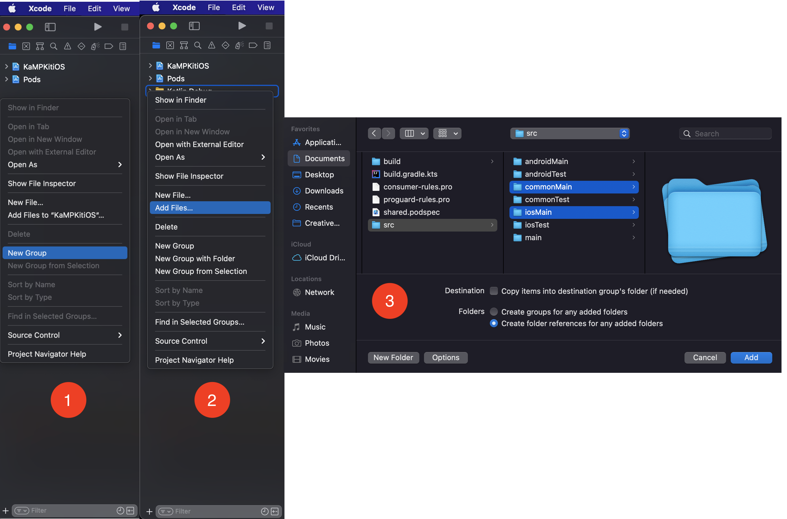
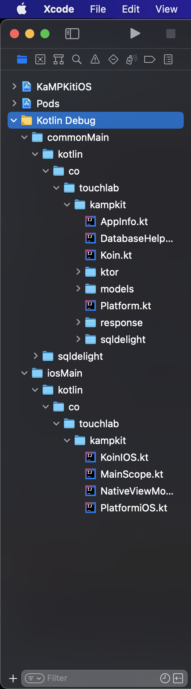

# Kotlin Native Xcode Support

Plugin to facilitate debugging iOS applications using Kotlin Native in Xcode. Defines Kotlin files as source code, with basic highlighting. Allows you to set breakpoints and includes llvm support to view data in the debug window. Xcode does not officially support custom language definitions, but they also don't explicitly block them.

> ## Touchlab's Hiring!
>
> We're looking for a Mobile Developer, with Android/Kotlin experience, who is eager to dive into Kotlin Multiplatform Mobile (KMM) development. Come join the remote-first team putting KMM in production. [More info here](https://go.touchlab.co/careers-gh).

## Installation

First you need to install the CLI that takes care of installing the plugin into Xcode. The CLI is available throuh Homebrew:

```shell
brew install touchlab/homebrew-touchlab/xcode-kotlin --head
```

Once installed, run the CLI:

```shell
xcode-kotlin install
```

This will install the plugin with support for all of your currently installed Xcodes. After install completes, Xcode will ask if you want to Load Bundle. You need to do that, or Xcode will not load the changes.

For advanced users, or if you have issues, you may want to install manually. There are 2 parts to Kotlin support: 1) debugging support and 2) language color and style formatting.

You need to tell Xcode that `*.kt` files are source files, and run an lldb formatter script when debugging starts. Look at the `setup.sh` script in the `legacy` directory and see the folders where those parts go.

## Usage

If properly set up, you should be able to add Kotlin source to Xcode, set up breakpoints, and step through code. To add Kotlin source to Xcode, follow these steps:

1. Add a New Group to the Xcode project.
2. Add Files to the newly created group (Kotlin Debug in this instance).
3. Select the folders in the Kotlin library that are directly relevant to the iOS build, which will usually be `commonMain` and `iosMain`. Make sure "Copy items into destination group's folder (if needed)" is unchecked.



When you're done, your Xcode project structure should look something like this:



### Sample

The project used as an example above is [KaMPKit](https://github.com/touchlab/KaMPKit/). Check it out if you want to see a project that already includes Kotlin file references in Xcode. It's an excellent template for Kotlin multiplatform mobile projects.

### Sources

Setting up the Plugin has been an amalgam of various source projects, as Xcode "Plugins" are undocumented. The most significant piece, the language color file came from other color files shipped with Xcode. Xcode plugin file from [GraphQL](https://github.com/apollographql/xcode-graphql/blob/master/GraphQL.ideplugin/Contents/Resources/GraphQL.xcplugindata)

LLDB formatting originally comes from the Kotlin/Native project, source [konan_lldb.py](https://github.com/JetBrains/kotlin-native/blob/dbb162a4b523071f31913e888e212df344a1b61e/llvmDebugInfoC/src/scripts/konan_lldb.py), although the way data is grabbed has been heavily modified to better support an interactive debugger.

## Possible Future Stuff

Check out the [Discussions](https://github.com/touchlab/xcode-kotlin/discussions/).

## Xcode Updates

Every time your Xcode is updated, the plugin needs to know its UUID. If you have the CLI installed, run:

```shell
xcode-kotlin repair
```

It will make sure all of your installed Xcodes' UUIDs are added to the plugin's compatibility list.

If you installed the plugin manually, the UUID needs to be added to `Kotlin.ideplugin/Contents/Info.plist`. To find the UUID of your version of Xcode, run the following:

```
defaults read /Applications/Xcode.app/Contents/Info DVTPlugInCompatibilityUUID
```

Info [from here](https://www.mokacoding.com/blog/xcode-plugins-update/)

## Troubleshooting

If you're having any issues, try reinstalling the plugin:

```shell
xcode-kotlin uninstall
xcode-kotlin install
```

If it doesn't fix the issue, run:

```shell
xcode-kotlin info
```

This will show you status of the plugin and a list of found Xcodes. If the Xcode you want to use isn't listed you can run the `repair` command and provide it with paths to Xcodes to add support for:

```
xcode-kotlin repair /Volumes/ExternalVolume1/Xcode.app
```

If the issue still persists, open a new GitHub issue and include the output of the `info` command.
